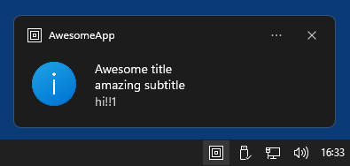

# ruwps
**R**idiculously **U**ncomplicated **W**indows **P**ython **S**ystray apps.

``ruwps`` exposes Winapi functions as Python classes and functions which greatly simplifies the process of creating a system tray application, i.e. an application that is supposed to run in the background and only has a minimal GUI based on menus and simple dialogs. It's a complement to [``rumps``](https://github.com/jaredks/rumps), sharing (mostly) the same API, which allows the fast creation of Windows/macOS cross-platform system tray/statusbar applications based on the same code.

Here a minimal example app:
```python
import ruwps

class AwesomeApp(ruwps.App):
    @ruwps.clicked("Preferences")
    def prefs(self, _):
        rumps.alert("jk! no preferences available!")

    @ruwps.clicked("Silly button")
    def onoff(self, sender):
        sender.state = not sender.state

    @ruwps.clicked("Say hi")
    def sayhi(self, _):
        ruwps.notification("Awesome title", "amazing subtitle", "hi!!1")

if __name__ == "__main__":
    AwesomeApp("Awesome App").run()
```
And here the same app as above, but written in a way so that it runs both in Windows and macOS:
```python
import sys

IS_MAC = sys.platform == 'darwin'
IS_WIN = sys.platform == 'win32'

if IS_MAC:
    import rumps as rups
elif IS_WIN:
    import ruwps as rups
else:
    print('Linux not supported!')  # We really also need rulps! ;-)
    sys.exit(1)

class AwesomeApp(rups.App):
    @rups.clicked("Preferences")
    def prefs(self, _):
        rups.alert("jk! no preferences available!")

    @rups.clicked("Silly button")
    def onoff(self, sender):
        sender.state = not sender.state

    @rups.clicked("Say hi")
    def sayhi(self, _):
        rups.notification("Awesome title", "amazing subtitle", "hi!!1")

if __name__ == "__main__":
    AwesomeApp("Awesome App").run()
```

The resulting app running in Windows 11:  



The resulting app, based on ``rumps``, running in macOS:  


## Installation

Since ``ruwps`` has no dependancies (other than Python 3), no real installation needed, either bundle the ``ruwps`` folder with your local project or copy it to Python's site-packages folder.

## Examples

The [examples](examples/) folder contains 9 example Python scripts, which were all directly copied from ``rumps`` and then made cross-platform.

## Freezing (creating standalone .exe)

Running batch script [make_dist_windows.cmd](examples/make_dist_windows.cmd) in the examples folder will create a standalone .exe for the minimal "AwsomeApp" demo shown above. If you have [7-Zip](https://7-zip.org/) installed at the default location, the script will also create a file called "AwesomeApp-x64-portable.7z". If you have [NSIS](https://nsis.sourceforge.io/Main_Page) installed at the default location, the script will also create a file called "AwesomeApp-x64-setup.exe".  
Running [make_dist_macos.command](examples/make_dist_macos.command) in macOS will create a standalone app for macOS as well as a compressed .dmg image called "AwesomeApp.dmg", based on the same Python code and ``rumps`` instead of ``ruwps``.

## Documentation

The ``ruwps`` API is (almost) the same as for ``rumps``, so you can refer to this documentation: https://rumps.readthedocs.org

But of course there are some differences, since the underlying system APIs differ. Here some of those differences:
* The app's systray icon is loaded from an .ico file (instead of a .icns file in macOS). If you don't specify a custom icon, at dev time some arbitrary b&w default icon (see screenshots) is used, while in a frozen application the application's main icon (that was passed to pyinstaller) is used instead.
* The Winapi doesn't support automatic icon conversion based on the user's current light/dark mode, therefor the optional ``template`` argument of the App's constructor works differently in ``ruwps``, if it is specified and set to True, the ``icon`` argument has to be a tuple/list of two icon files, and the first is then used in light and the second in dark mode.
* Menu icons (optional) are loaded from .bmp files (instead of .png or .jpg files in macOS). The optional ``dimensions`` argument is ignored.
* In macOS the app can either show an icon or text in the statusbar, while in the Windows system tray it's always an icon. The ``title`` property of the App class instead only determines the icon's tooltip.
* If debug mode is activated and the app is frozen (i.e. there is no console to print to), debug infos are printed to the Windows debug console and can be monitored using Sysinternal's [DebugView](https://learn.microsoft.com/en-us/sysinternals/downloads/debugview).