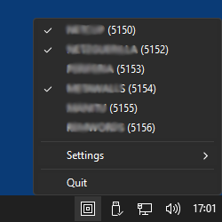
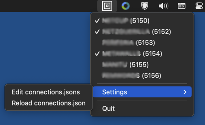

# SocksManager

A simple cross-platform demo application based on ``ruwps`` in Windows and ``rumps`` in macOS

SocksManager is a system tray/statusbar application that allows to start/stop/manage multiple local SOCKS5 proxies, i.e. SSH tunnels to remote machines that can be used as proxies in browsers, download tools etc. One use case for this are mass downloads in tools like JDownloader from file servers that only allow a single download per IP at the time. By adding multiple proxy configurations to JDownloader and then starting/stopping proxies as needed this limitation can be circumvented, and therefor stuff can be downloaded much faster.

## connections.json

To keep things simple, proxy configuration has to be done manually by editing a JSON file called "connections.json" using a text editor. The file contains an array (of arbitrary length) of objects, where each object represents a SSH connection (SOCKS5 proxy).

Example file:
```json
[
	{
        "name": "WHATEVER0 (5150)",
        "host": "166.66.66.66",
        "user": "foo",
        "key_file": "~/.ssh/id_rsa",
        "local_port": 5150
	},
	{
        "name": "WHATEVER1 (5151)",
        "host": "some.domain.com",
        "user": "bar",
        "password": "AMcKjF8G_YGH!B3R",
        "local_port": 5151,
        "reconnect": true
	},
	{
        "name": "WHATEVER2 (5152)",
        "host": "177.77.77.77",
        "user": "foobar",
        "key_file": "~/.ssh/other_private_key",
        "local_port": 5152,
        "remote_port": 2222,
        "reconnect": true,
        "autostart": true
	}
]
```

Required keys:
* "name" (string): the connection's display name in the menu
* "host" (string): the remote server's domain or IP
* "user" (string): the SSH username on the remote server
* either "key_file" (string) or "password" (string).  
For "key_file" in Windows forward slashes are supported, and a leading "~" is translated to %USERPROFILE%
* "local_port" (int): the local SOCKS5 port to be used.  
In browsers/download tools the proxy server is then specified as localhost:local_port, so e.g. localhost:5150

Optional keys:
* "remote_port" (int, default=22)
* "reconnect" (bool, default=false): if true, a broken connection is automatically reestablished
* "autostart" (bool, default=false): if true, the corresponding connection is automatically started when the application starts

## Screenshots

SocksManager running in Windows 11 system tray: 



SocksManager running in macOS 13 statusbar:   


